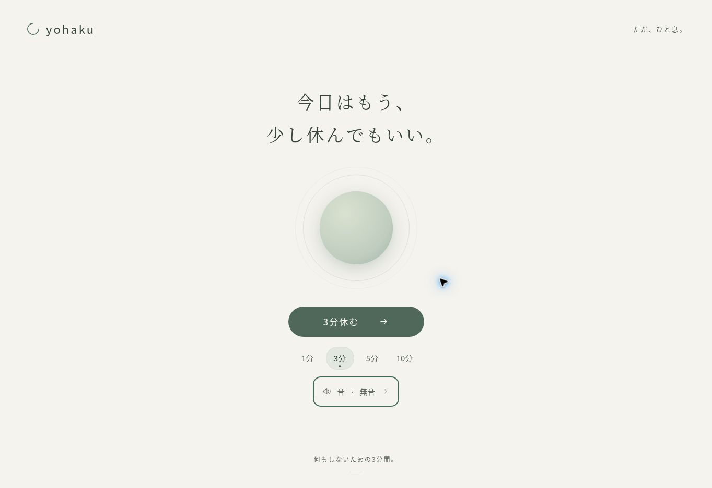
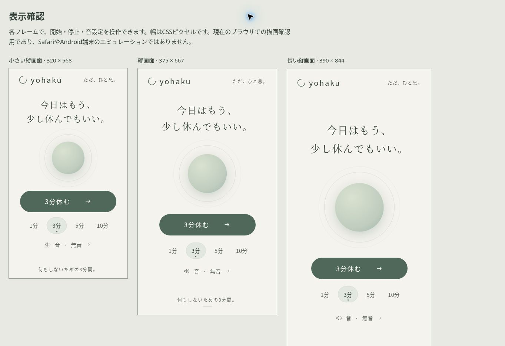
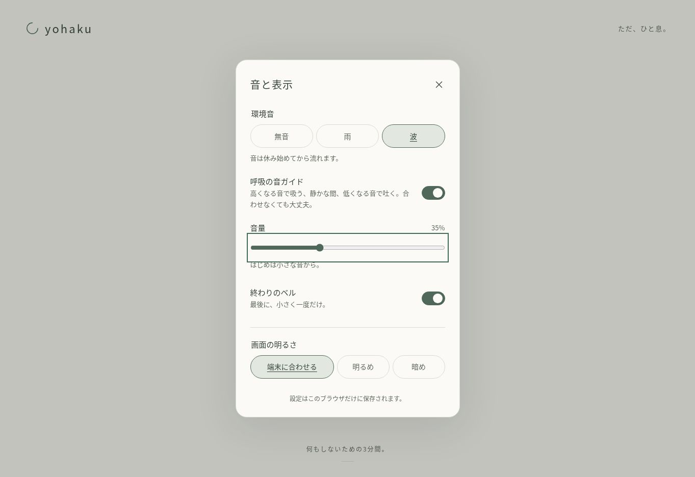

# 検証記録

## 呼吸ガイドの音色追加（2026-10-04、版20261004-15）

- 従来のやわらかな音に、温かな低音・鈴の音・息の音を追加。すべてアプリ内の合成音。
- リズムと音色を独立して選択・保存。ガイドのバッファと再生元は両方の選択に応じて更新。
- 全4音色×全4リズムで合図・無音区間・周期・滑らかな境界・停止と再開・解放を検証。
- 音色変更時の位相・環境音・終了時刻の維持、設定保存・復元・不正値、停止中やOFF時の自動再生防止、音声準備中の連続変更を検証。
- 4音色の波形の差、低音の高さ、48kHzで息の合図の音量補正とピークの余裕を検証。
- 自動テスト95件、構文チェック、HTML・参照・版番号の静的検査を実施。

今回も変更後の実ブラウザ描画・実機での音の聴感は未確認です。波形や再生処理の自動検証と区別します。

## 呼吸リズムの選択追加（2026-10-04、版20261004-14）

- 従来の4・2・6秒に加え、息を止めない4・6秒、4・4秒、5・5秒を追加。
- 円の動きと音ガイドは同じ設定から周期・吐く位置を決定。音OFFでも円のリズムを選択可能。
- 4種類それぞれの円の吸う／吐くの切り替え、音の合図・無音区間・ループ周期を自動検証。
- 周期が同じ4・6秒→5・5秒でも音の吐く位置を更新し、環境音と終了時刻を維持することを検証。
- 設定保存・復元・不正値の初期化、一時停止中の変更と再開、音声準備中の連続変更を検証。
- 自動テスト86件、構文チェック、HTML・参照・版番号の静的検査を実施。

ブラウザ起動に対する環境の制限は継続しています。変更後の実機描画・音の聴感は未確認です。

## 6時間への上限延長（2026-10-04、版20261004-13）

- 数値入力・スライダー・設定保存を1〜360分へ拡張。1分刻みで指定可能。
- 1〜360分の入力同期、360分の復元、361分以上の不正な保存値と範囲外入力の補正を検証。
- 120・180・360分の終了と再スタートを追加検証。
- 全6種類の合成環境音とガイド・ベルの6時間相当の継続・終了・解放を検証。
- 録音の雨は6時間相当で32回のクロスフェードと再生元2つの使い回し、終了時の解放を検証。
- 自動テスト78件、構文チェック、HTML・参照・版番号の静的検査を実施。

時間の検証はシミュレーションです。実機で6時間の実時間再生を試聴した検証ではありません。

## 最新の改善と再点検（2026-10-04、版20261004-12）

以下は今回の変更に対する検証です。下記の過去のChrome確認は今回の版のブラウザ検証を意味しません。

- `node tests/app.test.cjs`：75件すべて成功。時間を進めるシミュレーションであり、実時間の60分試聴ではありません。
- `node --check app.js` と `node --check tests/app.test.cjs`：成功。
- HTMLのタグ対応、重複ID、ARIA参照、相対ファイル参照、JSから参照するID、Manifest、CSSの括弧、版番号を静的検査：成功。
- 全6種類の合成環境音の終了予約と、画面更新停止中の音声終了・ノード解放を確認。
- 録音の音声時計による終了ゲート、遅い読み込み後のフェードイン、中断時の遅い再生準備完了、再生中断後の復帰を確認。
- 録音のクロスフェード中断時に旧再生元を止め、残ったゲイン予約を解消することを確認。
- 録音の停止に例外があっても、URL・他の音声ノードを解放することを確認。
- 録音の音量倍率4とコンプレッサー設定を確認。録音自体を変更せず、大きな瞬間音を抑制。実ブラウザでのコンプレッサー出力や聴感は未確認。
- 画面保持の初期OFF、開始・停止・タブ復帰・終了、遅い許可の取り消し、停止後の再取得、拒否、未対応時の説明を確認。
- 表示中の端末時刻変更がタイマーへ影響しないこと、非表示中にOSスリープで単調時計が止まる場合の復帰補正を確認。
- タブの残り時間表示、非表示設定、一時停止の表示、時間・音量の読み上げ値を確認。
- 短い縦画面で装飾を省くCSSと、設定ダイアログの閉じるボタンを含む見出しの固定をレビュー。

修正後にタイマー・音声・設定保存・非同期の中断と解放・画面表示・公開構成を再点検し、この確認範囲で追加の不具合は見つかりませんでした。

今回の実行環境ではブラウザの起動がOSのプロセス／IPC制限で拒否されました。そのため変更後の実ブラウザ描画、スマートフォンでの画面ロック、読み上げ、60分の実時間再生は未確認です。OS・ブラウザによる音声停止や画面保持の拒否・解除は防げない場合があります。「改善点が絶対にない」とは保証しません。

実装の条件は [performance.now（MDN）](https://developer.mozilla.org/en-US/docs/Web/API/Performance/now)、[Screen Wake Lock API（MDN）](https://developer.mozilla.org/en-US/docs/Web/API/Screen_Wake_Lock_API) を参照しました。

実施日：2026-10-03、2026-10-04（公開版のChrome確認）

## 実施済み

- `node --check app.js`：JavaScriptの構文エラーなし
- `node --test tests/app.test.cjs`：43件すべて成功（2026-10-04の音声改善後）
- 1・3・5・10分の開始・終了・再スタート
- コールバックを大幅に遅延させた場合の残り時間と終了の同期
- 一時停止中の時間保持、再開、途中終了、ページ離脱時の音停止
- 呼吸4秒・2秒・6秒の切り替えと、reduced motion時の静止
- 残り時間の表示切り替え、設定ダイアログのフォーカス復帰
- 設定を開いたままタイマーが終了した場合のフォーカス移動
- 設定の保存・復元、壊れた設定、保存を拒否された場合の継続
- 初期の自動再生なし、雨・波の別々の音声グラフ、音量変更、音量0
- ベルの終了予定時刻への一度の予約、停止・再開時の旧予約取り消し
- 中断されたAudioContextのベルを取り消し、後から鳴らさない処理
- 音声生成・再生許可のエラー時にもタイマーを継続
- 音の準備中に終了した場合の、遅れた音の再生防止
- 合成ノイズの有限値・振幅範囲、ループ境界の連続性
- PythonのHTTPサーバーで `/yohaku/` の下からHTML・CSS・JS・Manifest・faviconを配信し、200応答を確認
- HTML内のID重複なし、ローカル参照先の存在、`lang="ja"`、ボタンのtype属性
- ManifestのJSONとアイコンの寸法、OGP画像1200×630px
- ARIA参照・ネイティブのラジオ／レンジ／スイッチ／ダイアログ、フォーカスCSSをコードレビュー
- 320px以上の縦画面、小さな画面、横画面用のCSSをコードレビュー
- 外部API・フォント・音声の読み込み、解析コード、アカウント機能なし

文字のコントラストはPythonでWCAGの相対輝度式を使って確認しました。

| 組み合わせ | 比率 |
| --- | ---: |
| 明るい背景・本文 | 9.19:1 |
| 明るい背景・補助文字 | 5.13:1 |
| 明るいテーマ・開始ボタン | 5.80:1 |
| 暗い背景・本文 | 10.92:1 |
| 暗い背景・補助文字 | 6.56:1 |
| 暗いテーマ・開始ボタン | 7.55:1 |

ホバー時の補助文字は本文色に切り替え、背景が変わっても読めるようにしています。
選択中の時間には小さな点、設定の選択には下線を加え、色だけに依存しない表示にしています。

## 全体の再レビューと修正（2026-10-04）

HTML・CSS・JavaScript、設定保存、音声処理、タイマー、Manifest、画像、README、公開構成を照合しました。
次の改善を実装し、33件のロジックテスト・JavaScript構文チェック・ローカルHTTP配信・静的ファイル検査で確認しました。

- 音声の時計が中断中に止まっても、復帰時のベルを現在の残り時間に合わせ直す
- `statechange`が来ない場合も、画面への復帰時に音声状態を再確認する
- 期限後の音声復帰では、遅れて鳴るベルを取り消す
- 環境音・ベルの生成途中で失敗した場合も、それまでに作った全ノードを切断する
- 停止処理に例外があっても切断を実行し、タイマーと終了操作を継続する
- 環境音の停止とベルの余韻後に全ノードを解放し、AudioContextを休止する
- ベルの切り替えや音量変更で、環境音を不要に再生成しない
- 音声準備中の設定連続変更では、最後の設定だけを再生する
- 音声APIがない環境、webkitAudioContext、cancelAndHoldAtTime未対応時の代替処理を確認する
- 時計の巻き戻しで、残り時間や呼吸の位相が逆行しないようにする
- 一時停止中のreduced motion切り替えも円を静止させる
- 保存された端数の音量を、音量レンジと同じ整数に揃える
- ベルスイッチのつまみを見分けやすくし、forced colorsではシステム色を使う
- 明るさ設定の文字を14pxへ拡大する
- 7種類の幅・高さで同じアプリを操作する[表示確認ページ](tests/responsive.html)を用意する
- 小さい縦画面の余白を調整し、768px高のPCで不要な縦スクロールを減らす
- 568px幅の短い横画面も2列にし、開始ボタンを最初から操作できるようにする
- CSS・JavaScriptと確認用フレームのURLに版番号を付け、更新前のキャッシュが残るケースを解消する

音声のスタブは、AudioContext中断時に音声時計が停止することと、音声終了イベントを扱います。実際のブラウザや音の聴感を再現するものではありません。
静的検査では2つのHTMLのタグ対応、ID重複、ARIA参照、相対ファイル参照、CSSの括弧、Manifest、アイコンサイズ、OGPを確認しました。
GitHub Pagesと同じ`/yohaku/`で9つの配信先の200応答と、ローカルファイルとの内容一致を確認しました。

## 公開版のPC Chrome確認（2026-10-04）

対象：[https://naru18vr.github.io/yohaku/](https://naru18vr.github.io/yohaku/)

アプリ実装コミット：`ac7512503e4e45ef34f257ec9114ee91af301a50`

- GitHub Pagesが有効で、[公開処理](https://github.com/naru18vr/yohaku/actions/runs/37166111300)が成功していることを確認
- 1363×936pxのPC Chromeで、ホーム画面とダークテーマの設定画面を目視確認
- 初期の「3分休む」から1操作で開始し、円の拡大・縮小と残り時間の更新を確認
- 1分・3分のタイマーを実時間で終了まで動かし、終了画面と見出しへのフォーカス移動を確認
- 5分・10分も選択して開始し、05:00／10:00の表示と途中終了を確認
- 一時停止・再開、残り時間の非表示／再表示、終了画面からの再スタートを確認
- 雨・波・無音、音量変更・音量0、ベルON/OFF、明暗テーマの切り替えを確認
- 音の操作中に、アプリの再生エラー表示が出ないことを確認（聴感の確認は含まない）
- Enterで開始、矢印キー／Homeで音量変更、Tabで設定内の移動、Escapeで閉じる操作を確認
- 設定を閉じた時に開いたボタンへフォーカスが戻ることを確認
- 確認範囲のコンソールにアプリ由来のerror／warnがないことを確認。ブラウザ拡張由来のメタデータ送信エラーは判定から除外
- 17件のロジックテストとJavaScript構文チェックを再実行し、すべて成功

確認後は3分・無音・音量35%・ベルOFF・端末に合わせる表示へ戻しました。

## 再レビュー後の公開版確認（2026-10-04）

最終のアプリ実装コミット：`829691f494da10bbb57fc4cb52e923cbc0b7ddce`

[公開処理](https://github.com/naru18vr/yohaku/actions/runs/37169747911)の成功と、最新のCSS・JavaScriptの版番号が公開画面に反映されていることを確認しました。

Chromeの[表示確認ページ](tests/responsive.html)で、次の7サイズを確認しました。寸法はフレームのサイズです。
短い横画面では縦スクロールを許可し、開始・一時停止・終了・音設定の各ボタンを画面内で操作できます。

| フレームサイズ | ホーム | 休息 | 終了 | 設定 |
| --- | --- | --- | --- | --- |
| 320 × 568 | 確認 | 確認 | 確認 | 確認 |
| 375 × 667 | 確認 | 確認 | 確認 | 確認 |
| 390 × 844 | 確認 | 確認 | 確認 | 確認 |
| 412 × 915 | 確認 | 確認 | 確認 | 確認 |
| 568 × 320 | 確認 | 確認 | 確認 | 確認 |
| 844 × 390 | 確認 | 確認 | 確認 | 確認 |
| 1024 × 768 | 確認 | 確認 | 確認 | 確認 |

- 全サイズで横方向のはみ出しがなく、開始・停止・再スタート／終了の各操作が成立することを確認
- 小さい縦画面とPCの不要なスクロールを修正した後、再測定して解消を確認
- 全7フレームの3分タイマーを実時間で終了まで動かし、終了画面を確認
- 全7フレームで音設定を開閉し、無音・ベルOFFへ変更してから開始
- 320pxでは設定の内容を縦スクロールで操作でき、閉じるボタンは44 × 44px、明るさ設定の文字は14pxであることを確認
- 320pxで明暗表示の切り替え、Escapeで閉じる操作、開いたボタンへのフォーカス復帰を確認
- 通常の公開ページでも、最新ファイルで波・ベルONの1分タイマーを実時間で終了まで確認
- 一時停止・再開、残り時間の非表示・再表示、音量0から35%への復帰、雨・波の連続切り替え、ベルOFF／ON、終了後の再スタートと途中終了を確認
- 通常ページと表示確認ページのコンソールにアプリ由来のerror／warnがないことを確認。ブラウザ拡張のエラーは除外
- ローカルとGitHubのファイル内容をGit blob SHAで照合し、相違なしを確認

確認後は通常ページの設定を3分・無音・音量35%・ベルOFF・端末に合わせる表示へ戻しました。
この確認範囲で、未解決の不具合は見つかっていません。

## 環境音の連続性と呼吸音ガイドの修正（2026-10-04）

- ノイズの先頭・末尾を平らな波形に寄せる処理を廃止し、連続したノイズを等電力で重ねる方式へ変更
- ループを4秒から20秒へ延ばし、波の音量の谷を浅く調整
- 任意の「呼吸の音ガイド」を設定に追加。初期OFF、既存の保存設定でもOFF
- 高くなる音4秒・静かな間2秒・低くなる音6秒を、円と同じ12秒周期で合成
- ガイドの途中ON・一時停止後の再開・音声中断からの復帰時に、経過時間の位相へ同期
- 画面更新が止まっても、Web Audioの時計でガイドを終了するよう予約
- ガイドOFF・音量0・終了・ページ離脱・音声エラー時に、音声ノードを解放
- 環境音とガイドを、音量・ベル変更や通常の画面復帰で不要に再開始しないことを確認
- スイッチの名前と説明をARIAで分離し、キーボード操作・44px以上の操作領域・forced colorsへの対応を維持
- `node --check app.js`と43件のロジックテストが成功

実際のアプリが生成した旧版・修正版の48kHzステレオノイズを、それぞれ5つの乱数シードで抽出しました。
Pythonで雨・波に近い帯域のフィルタを通して解析すると、旧版のつなぎ目前後40msのRMS振幅は通常部分の中央値で約14%でした。
修正版では雨が約104%、波が約100%となり、旧処理による周期的な音の落ち込みを解消できています。
これは合成波形の数値解析であり、実際の端末・出力機器での聴感確認ではありません。

ガイドの波形も48kHzで解析し、吸う部分の音の高さの上昇、吐く部分の下降、4〜6秒の振幅0、ループ境界での滑らかさを確認しました。
ロジックテストでは、停止・再開の位相、音量0、環境音とベルとの併用、音声時計停止、途中失敗、終了予約、ノード解放を確認しています。

## 音声改善後の公開版確認（2026-10-04）

実装コミット：`5e517f30e220bb4097cbb66d34cd62ff1f50c060`。
[Pagesの公開処理](https://github.com/naru18vr/yohaku/actions/runs/37171824899)が成功し、CSS・JavaScriptの`v=20261004-3`を公開画面で確認しました。

- PC Chromeで、呼吸ガイド・雨・終了ベルをONにした1分タイマーの開始、一時停止、波への変更、再開、自然な終了を確認
- 再スタート後、再生中の音量0／35%・ガイドOFF／ON・ベルOFF・途中終了を確認
- Spaceでガイドのスイッチを操作でき、Escapeで設定を閉じてフォーカスが戻ることを確認
- スイッチの名前が「呼吸の音ガイド」、説明が独立した文としてARIAに設定されていることを確認
- 320×568・375×667・390×844・412×915・568×320・844×390・1024×768の全7フレームでガイドをONにして開始し、実時間の1分で終了を確認
- 全7サイズで設定に横方向のはみ出しがなく、ガイドの入力領域が50×44pxであることを確認。高さが足りない画面では設定内容をスクロールできる
- 公開ページと表示確認ページに音声エラー表示や、アプリ由来のコンソールerror／warnがないことを確認
- 確認後は通常ページを3分・無音・音量35%・ガイドOFF・ベルOFF・端末に合わせる表示へ戻した

音の再生処理と波形の解析を確認しており、実際の出力音の聴感は確認していません。

## 呼吸音ガイドを短い合図へ変更（2026-10-04）

利用者の「音声ガイドが怖い」「やわらかい音だけ」という要望に合わせ、連続して音程が上下する音を廃止しました。
吸い始め・吐き始めにだけ、固定した高さの音が約1秒ずつ鳴ります。立ち上がりと余韻を滑らかにし、控えめな倍音を先に減衰させています。
ガイドの出力係数を0.12から0.08へ下げ、音が鳴っていない時間を長く取りました。初期OFF、環境音との併用、一時停止・再開の同期は維持しています。

案内の考え方は、[Calmの公式ガイド](https://eng.calm.com/blog/guided-mindfulness-meditation)と[Headspaceの少ないガイド・無音の選択肢](https://help.headspace.com/hc/en-us/articles/215036408-Can-I-listen-to-less-guided-sessions)を参考にしました。既存アプリの音源や声は使用していません。

公開前の確認：

- `node --check app.js`：構文エラーなし
- `node --test tests/app.test.cjs`：44件すべて成功
- 新しいガイドの短い合図・固定した音程・合図の間の無音・境界の急な振幅変化の抑制を確認
- 10分の雨とガイドを開始し、音源を途中で作り直さず終了すること、終了後に両方のノードを解放することをロジックテストで確認
- 実装から生成した波形をPythonで解析し、8kHz・44.1kHz・48kHzで有限値、振幅上限、無音区間、固定した周波数、境界の滑らかさを確認
- 変更前の公開版で「10分・雨・ガイド」を選び、10:00から開始できること、音のエラー表示が出ないことをPC Chromeで確認
- 公開リポジトリに録音音源ファイルがなく、雨はブラウザ内で合成する音であることを確認。READMEに「10分の雨を再生できるが、独立した録音ファイルは未公開」と明記

この確認は再生処理と波形の検証であり、出力音を聴いた評価ではありません。聴感は実際の端末での確認が必要です。

## 未実施と検証の限界

自動テストは最小のDOM・Web Audioスタブで実際のアプリのイベント処理を実行するロジックテストです。
描画エンジン、ブラウザの実際の自動再生制限、ネイティブのキーボード操作、音の聴感は再現しません。

公開版のPC Chromeと7種類のフレームによる描画は上記の範囲で確認できました。iPhone Safari／Android Chromeの実機、VoiceOver／TalkBack、reduced motionの実端末での表示、雨・波・呼吸ガイド・ベルの聴感は未確認です。フレームはSafariやAndroidの描画エンジン・OS・音声制御を再現しません。
5分・10分の終了や、大幅なバックグラウンド遅延・音声の失敗を意図的に発生させるケースはロジックテストで確認し、実ブラウザでは全ケースを再現していません。

GitHub Pagesのサブパスで参照が成立することはローカルHTTPと公開版のChromeで確認しました。
その他の実機での確認手順は [README](README.md#testing) にあります。

画面ロックやOSの省電力制御で音が停止する場合があります。復帰時のタイマー同期は実装していますが、バックグラウンドでの音とベルの継続は保証できません。
